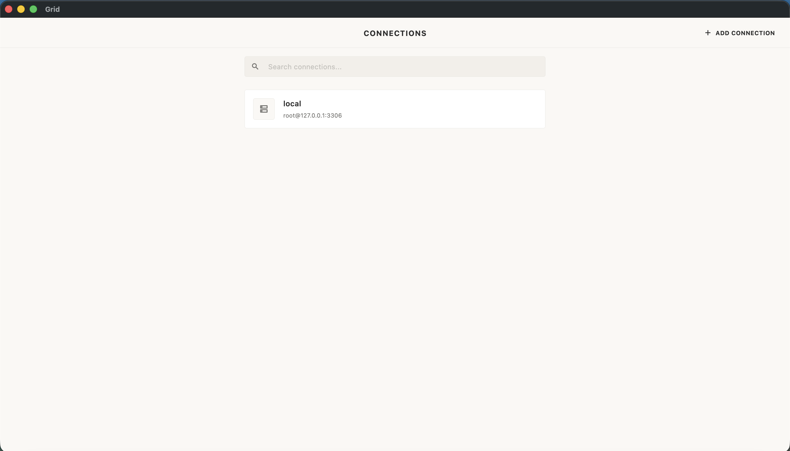
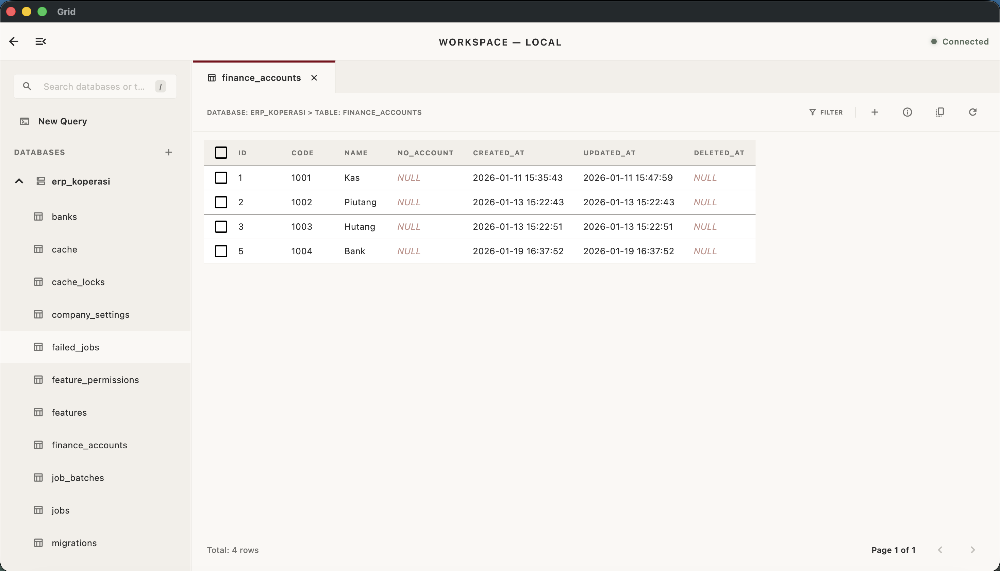

# Grid

Grid is a minimalist, high-performance database manager built with Flutter and Rust. Heavily inspired by the Muji design philosophy, it strips away visual clutter to provide a calm, highly focused, and incredibly utilitarian workspace for database interaction.

By leveraging Rust for the native core engine layer (`sqlx`) and Flutter Desktop for the reactive interface, Grid achieves zero-latency data streaming and an incredibly light memory footprint compared to traditional Electron-based database utilities.

<p align="center">
  
  
</p>


## ⚠️ Security Advisory & Disclaimer

Grid is currently in active development. **Connection parameters, credentials, and network data streams are not yet fully optimized for production-grade security.** - **Intended Use:** This utility is primarily built and tested for running queries against local development environments (`localhost` / `127.0.0.1`).
- **Risk Notice:** Connecting this client to remote, exposed, or production databases over public networks is done entirely **at your own risk**. 
- **Future Roadmap:** End-to-end credential encryption, secure native keychain storage, and SSH tunneling integrations are planned for future optimization cycles.


## Features

- **Stripped-back UI**: A warm, distraction-free environment utilizing structured whitespace, precise typography, and a deliberate absence of ornate borders or shadows.
- **Native Execution Speed**: Powered by asynchronous Rust drivers for instantaneous connection handling and query execution.
- **Efficient Memory Footprint**: Uses advanced native bridging to pass data arrays between the Rust core and Dart UI layer with minimal runtime overhead.
- **Cross-Platform Foundation**: Compiles directly to native machine code on macOS, Windows, and Linux without bundling a heavy browser engine in the background.


## Architecture

The application splits computational and presentation responsibilities to maximize safety, memory efficiency, and UI responsiveness:

```text
[ Flutter UI Layer ]           <--->   [ Flutter Rust Bridge ]   <--->   [ Rust Core Layer ]

- Muji-style Interface widgets         - Auto-generated FFI bindings     - Tokio Async Runtime
- State management & Tab arrays        - Safe Type conversion            - SQLx MySQL Connections
- Data table rendering                 - Zero-copy binary sheets         - Schema & Row Parsing
```
- **Frontend:** Flutter Desktop handles the window rendering, component layouts, and event tracking. It remains completely decoupled from database logic, operating as a presentation layer that requests data and renders the incoming results.
- **Backend:** Rust manages connection lifecycles, connection pooling, raw data manipulation, and direct socket communications with your target database servers.
  

## Technical Prerequisites

Before building Grid from scratch, ensure your machine has the following dependencies installed and configured:

1. **Flutter SDK** (Stable Channel) with Desktop Support enabled:
   ```bash
   # Enable desktop support for your operating system
   flutter config --enable-macos-desktop
   flutter config --enable-windows-desktop
   flutter config --enable-linux-desktop
   ```
2. Rust Toolchain: Installed via `rustup` along with `cargo`.
3. FVM (Flutter Version Management): Used to isolate the project's specific Flutter SDK execution environment.
4. Compilation Targets: Ensure your Rust toolchain has the target for your active platform:
```bash
# For macOS (Apple Silicon M1/M2/M3)
rustup target add aarch64-apple-darwin

# For macOS (Intel)
rustup target add x86_64-apple-darwin

# For Windows
rustup target add x86_64-pc-windows-msvc
```


## Development Setup

Follow this exact sequence to spin up your local development environment:

1. **Synchronize Dependencies**
Navigate to your project root directory and fetch all required Flutter and Dart packages defined in the configuration sheets:
```bash
fvm flutter pub get
```

2. **Install the Bridge Code Generator**
Install the matching global binary tool for compiling the FFI glue code between Dart and Rust:
```bash
cargo install flutter_rust_bridge_codegen
```

3. **Generate the Bridge Interfaces**
Every time you add, modify, or remove functions inside the Rust codebase (rust/src/api/), run the code generator to update the type-safe Dart bindings automatically:
```bash
flutter_rust_bridge_codegen generate
```

4. **Run the Application**
Compile and execute the application in release or debug mode natively on your machine:

For macOS:
```bash
fvm flutter run -d macos
```
For Windows:
```bash
fvm flutter run -d windows
```


## Project Configuration

Grid uses localized native modifications to fine-tune the window properties without polluting your Dart code with extra package dependencies.

**Native Launch Optimization (Maximized Mode)**
To ensure the user interface opens optimally on startup, native workspace configurations are applied directly to the runner build steps:

- **macOS Window Logic** (`macos/Runner/MainFlutterWindow.swift`):
Uses native AppKit functions (self.setIsZoomed(true)) inside awakeFromNib() to smoothly zoom the application window to full desk utilization while preserving the top menu bar and bottom dock.

- **Windows Window Logic** (`windows/runner/win32_window.cpp`):
Modifies the Win32 ShowWindow function parameter flags to pass SW_MAXIMIZE directly to the window kernel handler upon core initialization.

**Modifying Meta Titles and Manifest Icons**
- To change the window identity title or internal application package headers on macOS, alter the configurations directly inside macos/Runner/Configs/AppInfo.xcconfig.
- Application launcher icons are centrally compiled using the asset tool declaration block located inside the root pubspec.yaml sheet.


## License
Distributed under the MIT License. Designed and developed with utility, intention, and care.
